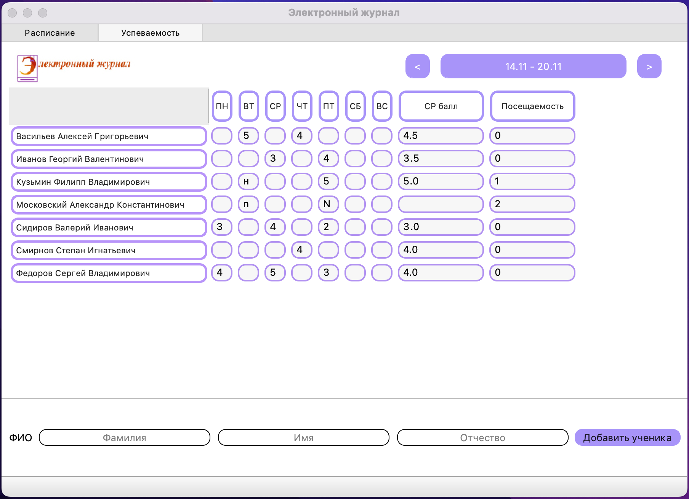

Teacher electronic journal
===
___
Desktop application for a teacher that allows him to give students grades and the number of absences from classes, as well as record his lesson schedule for each week.
___

___

